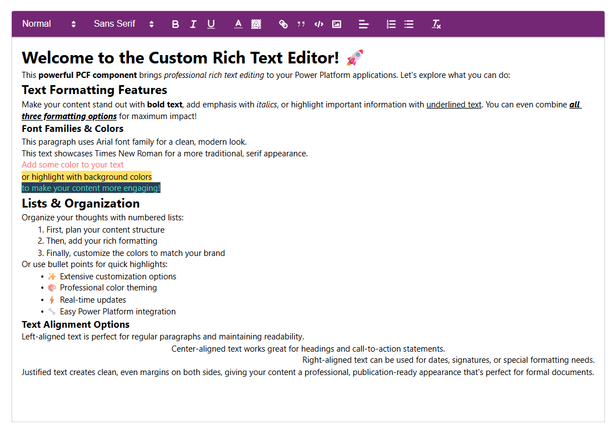
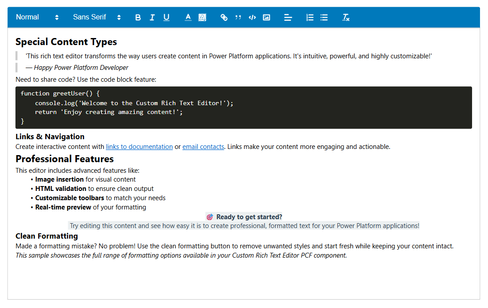

# PowerApps PCF Rich Text Component

A custom **PowerApps PCF Component** that integrates the [Quill Rich Text Editor](https://quilljs.com/) into your PowerApps apps.  
It allows rich text editing with formatting options like bold, italic, underline, bullet lists, and more.

**Installation:** Download from Releases section or from bin/Release/

 

## ✨ Features
📝 Rich Text Editing Capabilities
* **WYSIWYG Editor**: Full-featured rich text editing with real-time preview
* **HTML Output**: Generates clean HTML that can be stored and processed
* **Font Support**: Multiple font families including Arial, Times New Roman, Comic Sans, and more
* **Text Formatting**: Bold, italic, underline, strikethrough, and color options
* **Advanced Features**: Links, blockquotes, code blocks, and image insertion
* **Lists**: Ordered and unordered list support
* **Text** Alignment: Left, center, right, and justify alignment options

🎨 Extensive Visual Customization
* **Toolbar Styling**: Customizable background, text, and icon colors
* **Editor Styling**: Configurable background and border colors
* **Individual Border Control**: Separate color control for all 4 sides of both toolbar and editor
* **Dropdown Theming**: Custom colors for heading, font, and alignment dropdowns
* **Professional Defaults**: Clean white backgrounds with modern #444 text/icons

⚙️ Flexible Configuration Options
* **Toolbar Toggles**: Show/hide any toolbar button or feature
    * Bold, Italic, Underline formatting
    * Link and image insertion
    * List and alignment tools
    * Font family and color pickers
    * Code blocks and blockquotes
    * Clean formatting button
* **Heading Levels**: Configurable heading options (H1, H2, H3, etc.)
* **Color Exclusions**: Color picker dropdowns maintain default Quill styling for usability

## Property Categories
### Input Properties

| Property | Type | Required | Default | Description |
|----------|------|----------|---------|-------------|
| `Default` | SingleLine.Text | No | - | Initial value for the rich text input (similar to standard text input) |
| `headingLevels` | SingleLine.Text | No | - | Comma-separated heading levels to show (e.g. 1,2,3) |

### Color Customization Properties

#### Editor Styling
| Property | Type | Required | Default | Description |
|----------|------|----------|---------|-------------|
| `editorBackgroundColor` | SingleLine.Text | No | `#ffffff` | Background color of the editing area |
| `editorBorderColor` | SingleLine.Text | No | `#ccc` | General border color for the editor |
| `editorBorderTopColor` | SingleLine.Text | No | - | Top border color (overrides general border color) |
| `editorBorderRightColor` | SingleLine.Text | No | - | Right border color (overrides general border color) |
| `editorBorderBottomColor` | SingleLine.Text | No | - | Bottom border color (overrides general border color) |
| `editorBorderLeftColor` | SingleLine.Text | No | - | Left border color (overrides general border color) |

#### Toolbar Styling
| Property | Type | Required | Default | Description |
|----------|------|----------|---------|-------------|
| `toolbarColor` | SingleLine.Text | No | `#ffffff` | Background color of the toolbar |
| `toolbarTextColor` | SingleLine.Text | No | `#444444` | Color of toolbar text elements |
| `toolbarIconColor` | SingleLine.Text | No | `#444444` | Color of toolbar icons |
| `toolbarBorderTopColor` | SingleLine.Text | No | - | Top border color of the toolbar |
| `toolbarBorderRightColor` | SingleLine.Text | No | - | Right border color of the toolbar |
| `toolbarBorderBottomColor` | SingleLine.Text | No | - | Bottom border color of the toolbar |
| `toolbarBorderLeftColor` | SingleLine.Text | No | - | Left border color of the toolbar |

#### Dropdown Styling
| Property | Type | Required | Default | Description |
|----------|------|----------|---------|-------------|
| `toolbarDropdownColor` | SingleLine.Text | No | `#ffffff` | Background color for heading, font, and alignment dropdowns |
| `toolbarDropdownTextColor` | SingleLine.Text | No | `#333333` | Text color for dropdown elements |

### Feature Toggle Properties

| Property | Type | Required | Default | Description |
|----------|------|----------|---------|-------------|
| `showBold` | TwoOptions | No | `true` | Show/hide bold formatting button |
| `showItalic` | TwoOptions | No | `true` | Show/hide italic formatting button |
| `showUnderline` | TwoOptions | No | `true` | Show/hide underline formatting button |
| `showLink` | TwoOptions | No | `true` | Show/hide link insertion button |
| `showBlockquote` | TwoOptions | No | `true` | Show/hide blockquote button |
| `showCodeBlock` | TwoOptions | No | `true` | Show/hide code block button |
| `showImage` | TwoOptions | No | `true` | Show/hide image insertion button |
| `showOrderedList` | TwoOptions | No | `true` | Show/hide ordered list button |
| `showBulletList` | TwoOptions | No | `true` | Show/hide bullet list button |
| `showFont` | TwoOptions | No | `true` | Show/hide font family dropdown |
| `showColor` | TwoOptions | No | `true` | Show/hide text and background color pickers |
| `showAlign` | TwoOptions | No | `true` | Show/hide text alignment options |
| `showClean` | TwoOptions | No | `true` | Show/hide clean formatting button |

### Output Properties

| Property | Type | Required | Hidden | Description |
|----------|------|----------|--------|-------------|
| `HtmlText` | SingleLine.Text | No | Yes | Live HTML output from the editor (available for formulas and flows) |

## Color Value Format

All color properties accept standard CSS color values:
- **Hex Colors**: `#ffffff`, `#444444`, `#ff0000`
- **RGB Colors**: `rgb(255, 255, 255)`, `rgba(255, 0, 0, 0.5)`
- **Named Colors**: `white`, `black`, `red`, `blue`
- **HSL Colors**: `hsl(120, 100%, 50%)`

---

## 📜 License

This project is licensed under the **MIT License** – see the [LICENSE](./LICENSE) file for details.  

It also uses third-party libraries such as **Quill** (Rich Text Editor), which are licensed separately under their own terms.  
See [NOTICE.md](./NOTICE.md) for more information.
